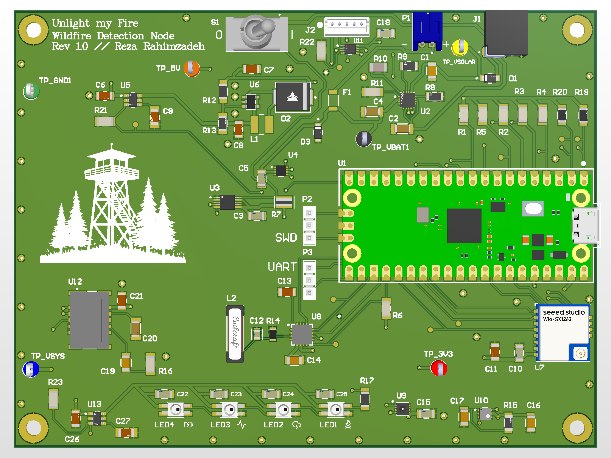

# Unlight My Fire

A solar-powered wildfire early-detection sensor node, built around a custom 4-layer mixed-signal PCB. The board carries five environmental sensors, runs unattended in the field on solar and a single LiPo cell, and reports over LoRa to a live dashboard.

Named after the Doors song, inverted — the point is to catch a fire before it starts.

## The idea

Most wildfire detection happens after there's already a fire: satellite thermal imaging, camera networks, someone calling it in. This node is meant to sit in the woods and watch for the conditions and early signatures that precede ignition, then report them continuously rather than waiting for a plume big enough to see from orbit.

Two constraints drove most of the design:

1. **It has to run for months without anyone visiting it.** Average current draw is the whole ballgame — a node that needs a battery swap every three weeks is useless.
2. **It has to sense several unrelated physical quantities at once**, which means a mixed-signal board with sensors that have very different power, timing, and noise requirements sharing one small PCB.

## Sensing

Five channels, chosen to cover both the conditions that make ignition likely and the signatures of combustion once it begins.

| Channel | Part | What it's for |
|---|---|---|
| Particulate | SPS30 | Smoke detection — PM1.0 through PM10 mass concentration |
| Lightning | AS3935 | Ignition risk before combustion; storm distance and energy |
| Temperature | SHT31 | Ambient conditions and fire-weather context |
| Humidity | SHT31 | Fuel moisture proxy; low RH plus high temp is the danger window |
| VOC | SGP40 | Volatile organics released by heated vegetation ahead of visible flame |

Sensors sit on a shared I²C bus with the AS3935 and share the MCU with an SPI link. The SPS30 is the power hog of the group by a wide margin and is the reason the board has a switched rail at all — it needs 5 V and far more current than everything else combined, but only during a sample.

Readings feed a confidence score rather than a single-sensor trip threshold, since no one channel is meaningful alone: a humidity reading means little by itself, but a multi-day drying trend plus a temperature spike plus a nearby strike is a real risk signal.

### Lightning detection

The AS3935 is the most interesting channel on the board. Dry lightning is a major ignition source, and detecting a strike flags elevated risk *before* anything is burning. It resolves storm distance in 14 steps out to 40 km and raises an interrupt on each event, which firmware uses to switch into an elevated-sampling storm mode.

The catch is that it's a resonant device: the antenna front end has to sit within a few percent of 500 kHz or sensitivity falls apart. PCB parasitics shift that resonance and aren't fully predictable before fabrication. The tank values are therefore biased so that the combination of expected parasitic loading and the chip's internal trim register can always pull the front end back into the required window, from either direction. This is the one part of the board where being close enough in the schematic wasn't good enough — it had to remain tunable after fabrication.

## Power

The node runs from a single-cell LiPo charged by a 6 V / 2 W Voltaic P126 solar panel, entering the board through a barrel jack and reverse-protection Schottky.

- **BQ24074** charger with Dynamic Power Path Management, strapped for fixed 500 mA charging. DPPM is the key feature: the system runs directly off the panel when there's sun and the battery only supplies the difference, so the cell isn't cycled by every passing cloud. Charge current, termination, and input limit are all resistor-programmed.
- **MAX17048** fuel gauge for state-of-charge reporting, so battery health shows up on the dashboard instead of requiring someone to hike out and check.
- **MIC2295** boost converter, 1.2 MHz fixed-frequency, generating the switched 5 V rail. A 4.7 µH semi-shielded inductor was chosen with enough saturation headroom to clear the converter's switch current limit.
- **TPS22918** load switch gating that rail, with inrush limiting and a quick-output-discharge path so the rail comes down cleanly when gated off.
- **INA228** 20-bit power monitor for measuring actual system draw on hardware rather than estimating it. Measured average system current is under 2.6 mA, which puts estimated field lifetime past six months.

### Power domains and sequencing

The board is partitioned so that subsystems which only run periodically draw nothing between samples. The switched 5 V rail is a single-destination supply feeding only the SPS30.

### One non-obvious constraint

The boost converter switches at 1.2 MHz. That frequency wasn't chosen for efficiency or inductor size — it was chosen so neither the fundamental nor its low harmonics land near the AS3935's 500 kHz resonant window. A switching supply parked on top of the lightning detector's passband would have desensitized the most novel channel on the board. This is the kind of interaction that only shows up when an analog resonant front end and a switcher share a small PCB.

## Board

- 4 layers, mixed-signal, Signal-Ground-Power-Signal
- Designed in Altium, hierarchical schematic — one sheet per functional block

[Full schematic (PDF)](UnlightMyFire_Schematic.pdf)

## Firmware

Embedded C++ on a Raspberry Pi Pico 2 (RP2350). Responsibilities:

- Sensor drivers over I²C and SPI
- Power domain sequencing and gating, including the inverted load-switch polarity above
- Interrupt handling for the lightning detector and the transition into storm mode
- Sensor fusion and confidence scoring
- Framing and transmitting samples over LoRa

## Data pipeline

Samples go out over LoRa to a gateway and land in a live Grafana dashboard for both real-time monitoring and historical trends. History matters as much as current readings here — the risk signal lives in how the channels move together over days, not in any single sample.
